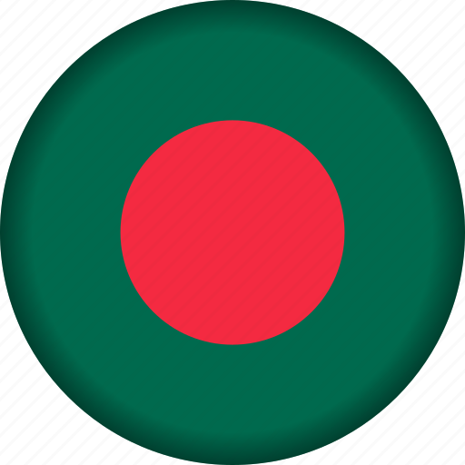

## 👋 &nbsp; Hi! Welcome to my Git Repo Home

Welcome to my repo!   I'm Md Mahadi Hassan, Fullstack Web App developer from  <b>Dhaka, Bangladesh.</b>

 
## I am comfortable with
#### Frontend Technologies & Packages
 &nbsp; &nbsp;  &nbsp; &nbsp;  &nbsp; &nbsp;  &nbsp; &nbsp;  &nbsp; &nbsp;  &nbsp; &nbsp;  &nbsp; &nbsp;  &nbsp; &nbsp; 

#### Backend Technologies & Packages

 &nbsp; &nbsp; &nbsp; &nbsp;

#### Databases

 &nbsp; &nbsp; &nbsp; &nbsp; &nbsp; &nbsp; 

#### Others

 

###### Where to find me

    
    
    
      

   
 
